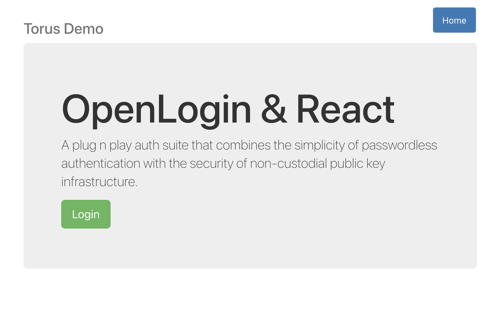
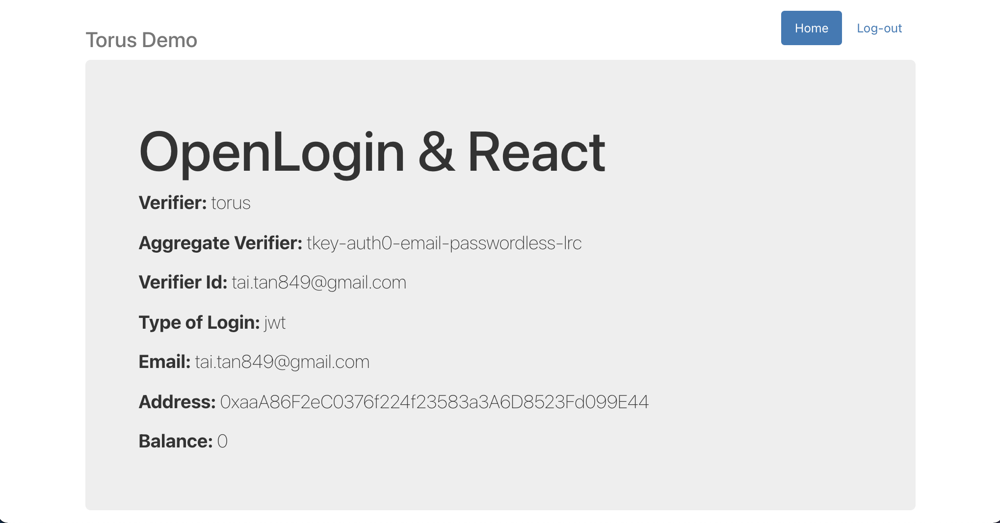

# OpenLogin - React
Integrate Torus OpenLogin with React application

## Getting started
- Install dependencies
```
yarn install
```
- Start the application
```
yarn start
```
- Screenshots





## Packages
- toruslabs/openlogin
- ethers